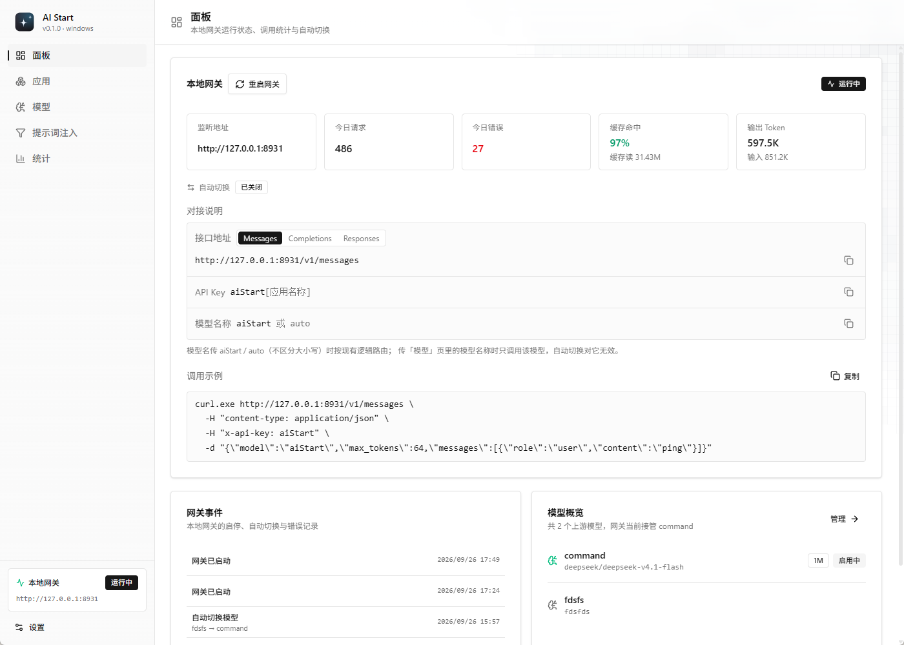
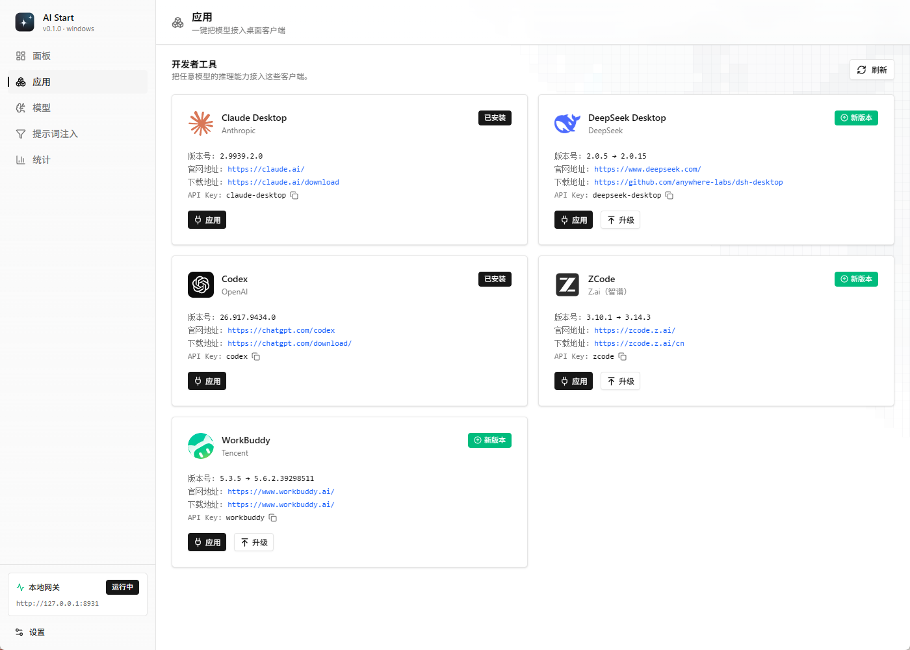
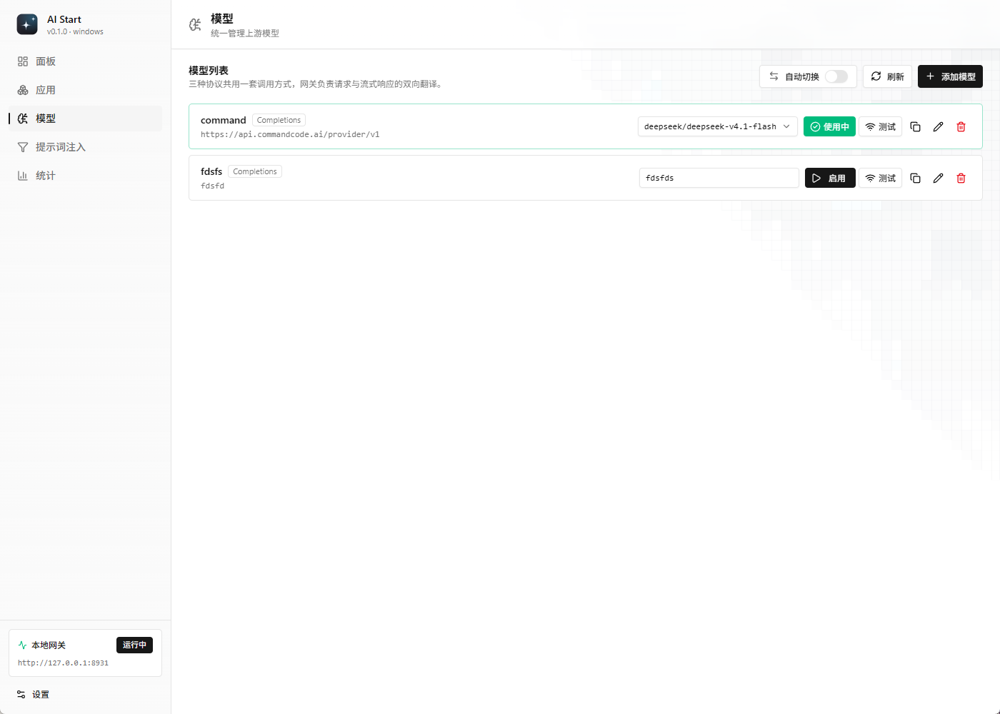
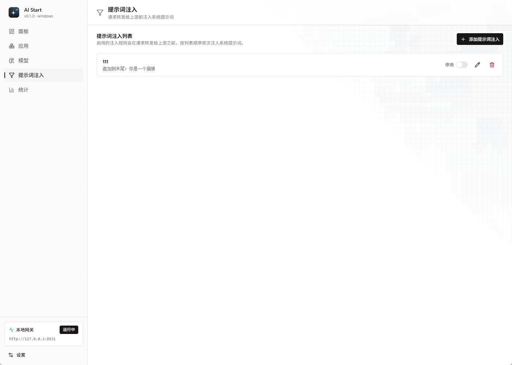
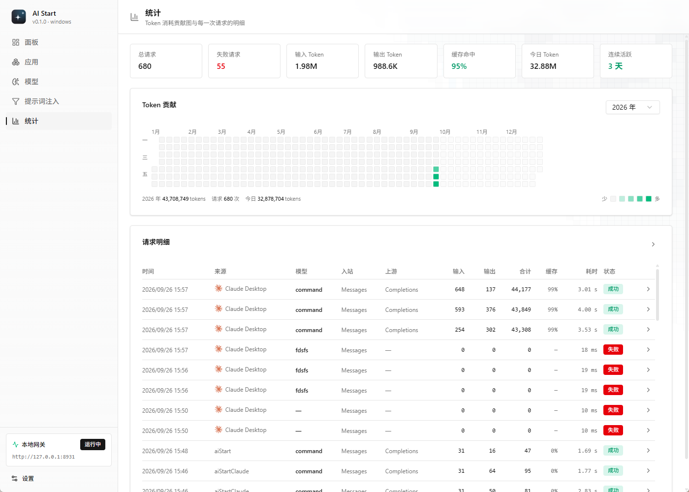
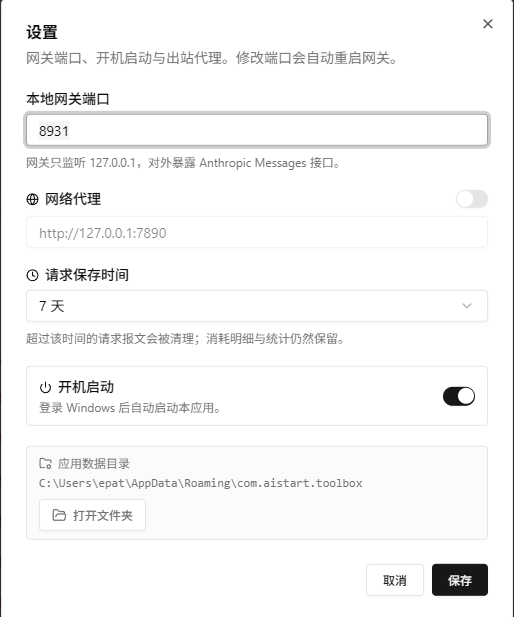

<div align="center">

# AI Start

**管理开发者工具的桌面工具箱**

一个 Windows AI 代理工具 · 一键把任意模型接入桌面客户端

[](https://github.com/2507483326/aiStart/releases/latest)
[](https://github.com/2507483326/aiStart/actions/workflows/release.yml)
[](https://github.com/2507483326/aiStart/releases)
[](#)
[](https://tauri.app)
[](https://vuejs.org)
[](https://www.rust-lang.org)

</div>


## 这是什么

一个 Windows AI 代理工具，你可以使用这个工具来一键配置 AI 接口，快速应用到各种不同的 AI 工具中。它还可以记录每一次 AI 的调用，让你可以看到每一次交互的细节

## 功能



**面板** —— 网关运行状态、调用统计、自动切换记录，以及模型概览。



**应用** —— 一键帮你将 AI 接口应用到桌面端当中。



**模型** —— 管理模型，并支持自动路由



**提示词注入** —— 还可以给请求追加或前置系统提示词。用来统一提示词



**统计** —— 在这里可以看到每次请求的详情和消耗



**设置** —— 在这里可以配置请求保存的时间，以及请求代理

## 从源码构建

需要 Node.js 24+、pnpm、Rust stable、以及 Windows 上的 WebView2。

```bash
pnpm install
pnpm tauri dev      # 开发（前端 dev server 16271，HMR 16272）

pnpm build                                        # 前端类型检查 + 构建
cargo test  --manifest-path src-tauri/Cargo.toml  # 后端测试
cargo check --manifest-path src-tauri/Cargo.toml

pnpm tauri build    # 打包，产物在 src-tauri/target/release/bundle/
```

